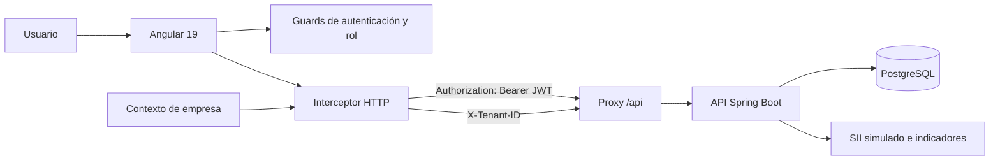

# DTE Digital — Frontend

Aplicación web para la gestión de empresas, clientes, productos y documentos tributarios electrónicos (DTE). El frontend ofrece autenticación con JWT, separación de datos por empresa, permisos por rol y un flujo simulado de envío y consulta de documentos ante el SII.

> Este repositorio contiene únicamente el frontend. Para utilizar todas las funcionalidades se necesita una API backend compatible ejecutándose, por defecto, en `http://localhost:8080`.

## Contenido

- [Características](#características)
- [Arquitectura](#arquitectura)
- [Tecnologías](#tecnologías)
- [Requisitos](#requisitos)
- [Instalación](#instalación)
- [Configuración](#configuración)
- [Comandos disponibles](#comandos-disponibles)
- [Roles y permisos](#roles-y-permisos)
- [Estructura del proyecto](#estructura-del-proyecto)
- [Pruebas](#pruebas)
- [Seguridad y multiempresa](#seguridad-y-multiempresa)
- [Equipo](#equipo)

## Características

- Autenticación mediante JWT y persistencia opcional de sesión.
- Autorización de rutas y navegación según rol.
- Selección de empresa activa para usuarios `SUPER_ADMIN`.
- Aislamiento multiempresa mediante la cabecera `X-Tenant-ID`.
- Paneles diferenciados para administración y superadministración.
- Gestión de empresas, usuarios, roles, clientes y productos.
- Administración de tipos de documentos, folios y archivos CAF.
- Creación, listado e importación de documentos tributarios desde TXT.
- Emisión, descarga en PDF y simulación del ciclo de envío al SII.
- Consulta del estado e historial de una operación simulada ante el SII.
- Auditoría de operaciones y visualización de indicadores económicos.
- Componentes reutilizables para tablas, formularios, botones y paginación.

## Arquitectura



La aplicación utiliza componentes standalone y una organización por funcionalidades. Los servicios encapsulan el acceso HTTP, mientras que guards, interceptores y el contexto de tenant concentran la seguridad y selección de empresa.

## Tecnologías

| Tecnología | Uso |
|---|---|
| Angular 19 | Framework principal del frontend |
| TypeScript 5.7 | Lenguaje de desarrollo |
| RxJS 7.8 | Flujos asíncronos y comunicación reactiva |
| Angular Forms | Formularios basados en plantillas |
| Angular Router | Navegación, guards y carga diferida |
| Tailwind CSS 3.4 | Utilidades de diseño |
| SCSS | Estilos específicos de componentes |
| Lucide Angular | Iconografía |
| Jasmine + Karma | Pruebas unitarias y de integración HTTP |

## Requisitos

- Node.js 20 o superior.
- npm 10 o superior.
- Google Chrome o Chromium para ejecutar las pruebas headless.
- Backend de DTE Digital disponible en `http://localhost:8080`.
- Credenciales válidas creadas en el backend.

Las credenciales y datos iniciales no forman parte de este repositorio.

## Instalación

1. Clona el repositorio:

   ```bash
   git clone https://github.com/GeraldineBecerra/facturacion-frontend.git
   cd facturacion-frontend
   ```

2. Instala las dependencias:

   ```bash
   npm install
   ```

3. Inicia el backend en el puerto `8080`.

4. Ejecuta el frontend:

   ```bash
   npm start
   ```

5. Abre [http://localhost:4200](http://localhost:4200) en el navegador.

## Configuración

### Proxy de desarrollo

El archivo [`proxy.conf.json`](proxy.conf.json) redirige las solicitudes iniciadas con `/api` hacia el backend local:

```text
Frontend: http://localhost:4200/api/*
Backend:  http://localhost:8080/*
```

Para utilizar otro host o puerto durante el desarrollo, modifica `target`:

```json
{
  "/api": {
    "target": "http://localhost:8080",
    "secure": false,
    "changeOrigin": true,
    "pathRewrite": {
      "^/api": ""
    }
  }
}
```

### Producción

La compilación de producción utiliza rutas relativas bajo `/api`. El servidor web o gateway debe redirigir esas rutas hacia la API backend y servir el resto de las rutas mediante `index.html` para permitir la navegación de Angular.

No almacenes tokens, contraseñas ni secretos dentro de los archivos `environment` o del repositorio.

## Comandos disponibles

| Comando | Descripción |
|---|---|
| `npm start` | Inicia el servidor de desarrollo con proxy |
| `npm run build` | Genera una compilación optimizada en `dist/facturacion-frontend` |
| `npm run watch` | Compila en modo desarrollo y observa cambios |
| `npm test` | Ejecuta las pruebas en modo interactivo |
| `npm run test:ci` | Ejecuta todas las pruebas una vez con Chrome Headless |
| `npm run test:coverage` | Genera el reporte de cobertura de pruebas |

## Roles y permisos

| Módulo | `SUPER_ADMIN` | `ADMIN` | `USER` |
|---|:---:|:---:|:---:|
| Dashboard | Sí | Sí | Sí |
| Empresas y selección de tenant | Sí | — | — |
| Usuarios | Sí | Sí | — |
| Roles | Sí | — | — |
| Clientes | Sí | Sí | — |
| Productos | Sí | — | — |
| Facturación | Sí | Sí | Sí |
| Folios y CAF | Sí | — | — |
| Tipos de documento | Sí | — | — |
| Auditoría | Sí | — | — |
| Perfil | Sí | Sí | Sí |

Los permisos del frontend mejoran la experiencia de usuario, pero la autorización definitiva también debe validarse en el backend.

## Estructura del proyecto

```text
src/
├── app/
│   ├── core/                 # Autenticación, guards, interceptores y tenant
│   ├── features/             # Módulos funcionales de la aplicación
│   │   ├── audit/
│   │   ├── billing/
│   │   ├── company/
│   │   ├── customers/
│   │   ├── dashboard/
│   │   ├── document-type/
│   │   ├── folio/
│   │   ├── login/
│   │   ├── product/
│   │   ├── profile/
│   │   ├── role/
│   │   └── user/
│   ├── layout/               # Navbar, sidebar y layout principal
│   ├── shared/               # Componentes UI, tablas y validaciones
│   ├── app.config.ts         # Proveedores globales
│   └── app.routes.ts         # Rutas y permisos
├── environments/             # Configuración por ambiente
└── styles.scss               # Estilos globales
```

Cada funcionalidad mantiene sus modelos, servicios y páginas dentro de su propio directorio para reducir el acoplamiento y facilitar el mantenimiento.

## Pruebas

Ejecuta la suite completa en modo CI:

```bash
npm run test:ci
```

Para generar cobertura:

```bash
npm run test:coverage
```

El reporte se genera en el directorio `coverage/`. La suite incluye pruebas de:

- Servicios y contratos HTTP.
- Guards, autenticación e interceptor JWT.
- Contexto multiempresa.
- Formularios y páginas funcionales.
- Componentes compartidos.
- Facturación, folios, clientes, empresas y auditoría.

Antes de enviar cambios se recomienda ejecutar:

```bash
npm run test:ci
npm run build
```

## Seguridad y multiempresa

- El token JWT se incorpora automáticamente como `Authorization: Bearer <token>`.
- El tenant activo se envía mediante `X-Tenant-ID`.
- Los guards impiden el acceso a usuarios no autenticados o sin el rol requerido.
- Un token vencido o inválido elimina la sesión local.
- Las respuestas `401` de recursos protegidos cierran la sesión.
- La empresa seleccionada se mantiene en `sessionStorage` y se limpia al iniciar o cerrar sesión.

La aplicación cliente no sustituye las validaciones de seguridad del servidor. El backend debe verificar siempre el JWT, el rol y el acceso al tenant solicitado.

## Equipo

Proyecto desarrollado para la asignatura **TPY1101 — Taller Aplicado de Programación** de Duoc UC.

- Geraldine Becerra
- Diego Pizarro
- Luis Muñoz
